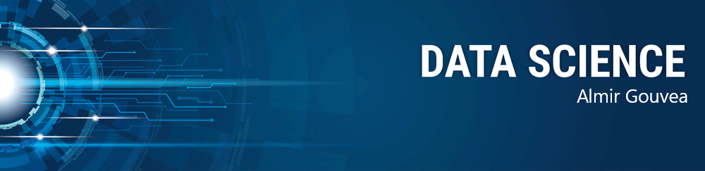

   

  

Aqui você encontra os *notebooks* dos meus projetos na área de Data Science, Machine Learning e Deep Learning.

## Projetos:
Lista de projetos em Jupyter Notebook:

* **Extraindo informações de Artigos em PDF:** https://bit.ly/34wN2Bv
---

### Sobre mim:

Profissional com 5 anos de experiência atuando em empresa de grande porte do segmento de Tecnologia da informação e serviços.

Sólidos conhecimentos em: Compreensão e resolução de problemas, Oracle EBS e Oracle Database (criação de usuários, contas de serviço e alterações de contas), Priorização de demandas e Aprendizado contínuo de novas tecnologias.

* Graduação em Bacharelado Interdisciplinar em Ciência e Tecnologia pela UNIFAL.
* Graduação em Engenharia de Minas pela UNIFAL.
* Mestre em Engenharia Mineral pela USP.

